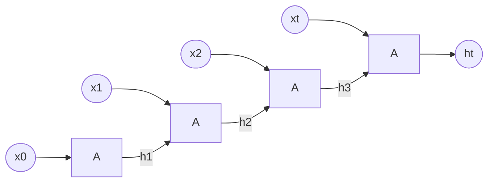

# RNN
- 시퀀스 데이터를 처리하기 위한 반복구조 신경망
RNN은 기본적으로 은닉층이 하나.

나는 너를 좋아해. 학습시킬 때

1. '나는'의 hidden state 구하기
h₁ = f(W · x₁ + U · h₀)
2. '너를'의 hidden state 구하기
h₂ = f(W · x₂ + U · h₁) 
3. '좋아해'의 hidden state 구하기
h₃ = f(W · x₃ + U · h₂)

W와 U는 한 문장 안에서 공유됨

## RNN의 한계
- 기울기 소실 문제: 역전파를 할 때 그래디언트가 반복적으로 곱해지며 점점 작아지는 현상
- 장기 의존성 문제: 앞부분의 정보를 뒷부분에서 기억하지 못하는 문제
## 기울기 소실과 장기 의존성 문제의 관계
1. 시퀀스 데이터가 길어짐
2. 기울기 소실 발생
3. 초반 입력이 학습되지 않음
4. 장기 의존성 문제 발생

대표적인 RNN
- Vanilla RNN
- LSTM: 장기 기억
- GRU: 계산량이 적고 빠름



RNN의 입출력
- 일대다: 이미지 설명
- 다대일: 감정분류, 스팸분류
- 다대다: 품사 태깅, 언어번역, 챗봇

주가 예측 -> 회귀문제

출력층 전에 MLP 사용해서 출력 개수 맞춰줌

# 생각해보기
`self.data = self.data / np.max(self.data)  #정규화 #(todo) 0과 1 사이의 값을 갖도록 정규화하세요`
```
#RNN 클래스 정의
import torch
import torch.nn as nn


#RNN모델 정의
class RNN(nn.Module):

   #모델에서 사용할 레이어 층들을 정의
   def __init__(self):
       super(RNN, self).__init__()


       self.rnn = nn.RNN(input_size=3, hidden_size=8, num_layers=5,
                         batch_first=True)  #RNN층의 정의
      #(생각해보기) 왜 input_size가 3일까요?
        #답: input_size는 하나의 시점에서 입력되는 feature의 개수를 의미함. 개장가, 최고가, 최저가 총 3개의 열을 사용함.
        #    즉, 1일에 대한 feature의 수가 3이기 때문에 input_size = 3임.
      #(알아보기) batch_first는 무슨 역할을 할까?
        #답: RNN의 입력 텐서 모양을 (batch, seq_len, input_size)로 수정해줌.
        # 직관적으로 다루기 쉽기 때문


       #주가를 예측하는 MLP층 정의
       #(생각해보기) 왜 in_features가 240이어야할까?
          # 시계열 길이가 30일이고, hidden_size를 8로 설정했기 때문에 30 * 8 = 240임

       self.fc1 = nn.Linear(in_features=240, out_features=64)
       self.fc2 = nn.Linear(in_features=64, out_features=1)
      #(생각해보기) 왜  out_features가 1인가?
        # 예측해야하는 값은 하루 뒤의 종가임. 즉, 1개의 값을 예측하기 때문임

       self.relu = nn.ReLU() # 활성화 함수 정의


  #모델이 실제 입력값을 받아 예측을 수행하는 부
   def forward(self, x, h0):
       x, hn = self.rnn(x, h0)  #RNN층의 출력 #RNN의 출력값은 (batch, 30(days), 8(hidden states) 모양임

       #MLP층의 입력으로 사용될 수 있도록 모양 변경 -> (batch, 240)으로 펼침
       x = torch.reshape(x, (x.shape[0], -1))

       # MLP 층을 이용해 종가를 예측
       x = self.fc1(x)
       x = self.relu(x)
       x = self.fc2(x)

       # 예측한 종가를 1차원 벡터로 표현
       x = torch.flatten(x)

       return x
```
```
plt.plot(preds, label="prediction")# 예측값 선 그래프
plt.plot(dataset.label[30:], label="actual")# 실제 종가 (30일 이후부터 비교하기 위해서)
plt.legend()
plt.show()


#(생각해보기)x축이 왜 800칸이 넘게 나올까?
  # 한 샘플당 30일치를 입력으로 사용하고, 그 다음날의 종가 1개를 예측하므로, 예측 가능한 시점이 전체샘플 수에서 30을 뺀 값이다.
  # 그러므로 800칸 이상의 예측값이 나올 수 있다.
```
